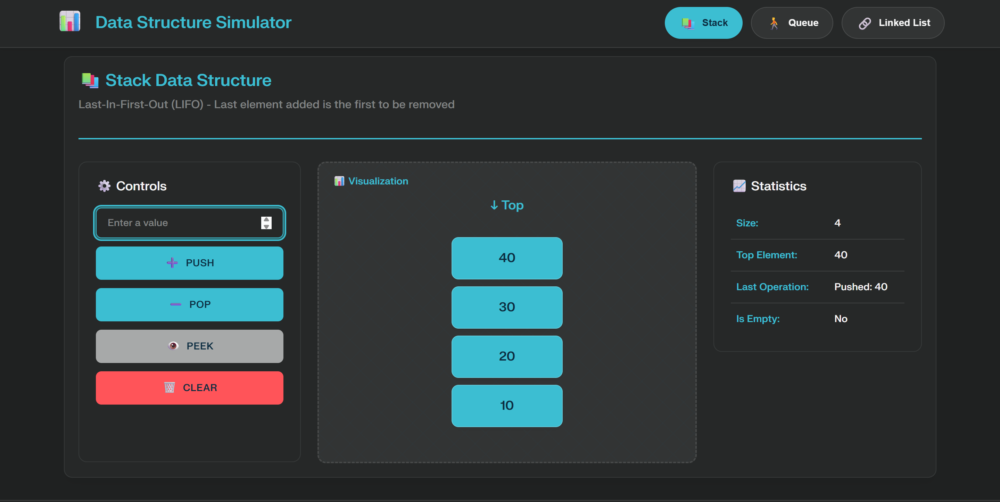
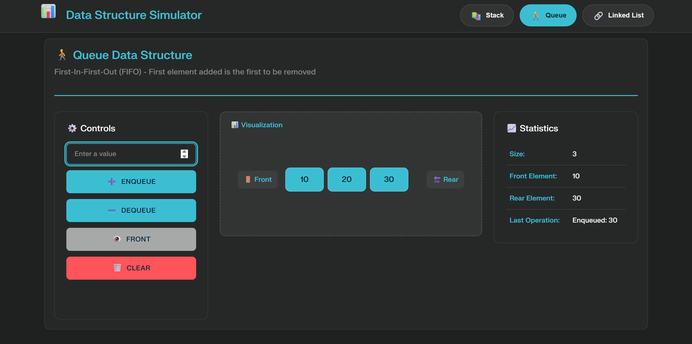
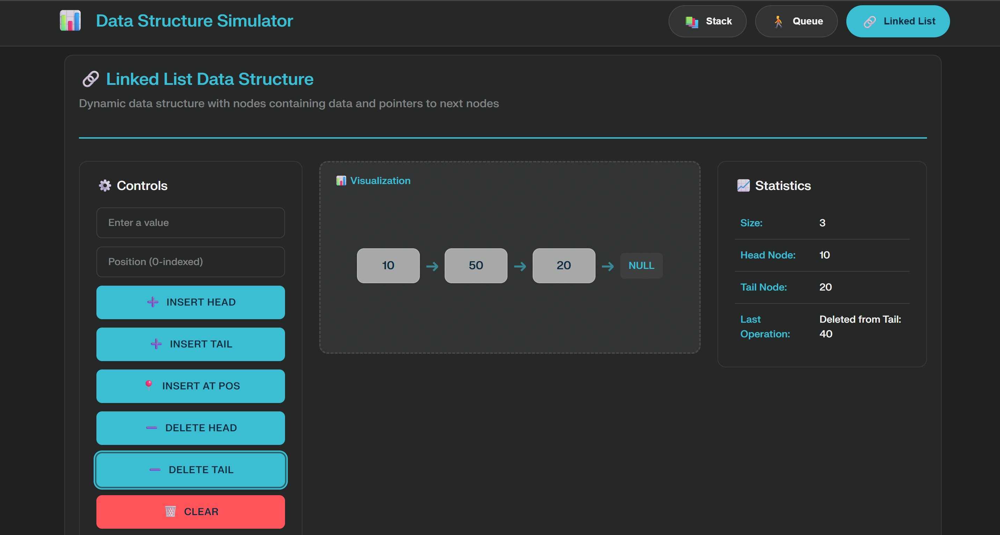

# 📊 Data Structures Simulator

Interactive visualizer for Stack, Queue, and Linked List with a clean dark UI.

[
[

---

## 📸 Screenshots
- Stack: `assets/stack.png`

	

- Queue: `assets/queue.png`
	
- Linked List: `assets/list.png`

	

---

## 🚀 Quick Start

```bash
git clone https://github.com/yourusername/struct-simulator.git
cd struct-simulator
npm install
npm start
# open http://localhost:3000
```

Alternative: open `public/index.html` directly for a static preview.

---

## ✨ Features
- Stack: push, pop, peek, clear with live stats
- Queue: enqueue, dequeue, front, clear with live stats
- Linked List: insert head/tail/position, delete head/tail, clear
- Modern responsive UI, dark theme, keyboard-friendly

---

## 📁 Project Structure
```
struct-simulator/
├── index.js          # Express server
├── public/
│   ├── index.html
│   ├── style.css
│   └── script.js
└── assets/           # Screenshots
```

---

## 🖥️ Usage
- Enter a value, click the action button for the chosen structure
- Stack: Enter + Push, Pop, Peek, Clear
- Queue: Enter + Enqueue, Dequeue, Front, Clear
- Linked List: Enter + Insert Head/Tail/Pos, Delete Head/Tail, Clear

---

## 🛠️ Tech
- HTML, CSS (custom), JavaScript (ES6+)
- Node.js + Express for local serving

---


## 📄 License
MIT License. See `LICENSE` for details.
